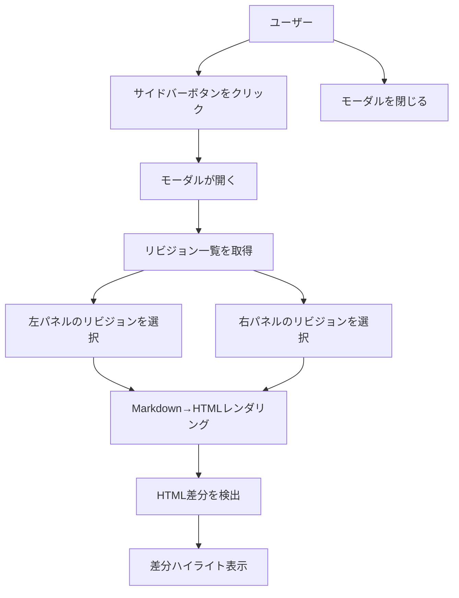

# 機能設計書

## 1. システム構成図

```
┌─────────────────────────────────────────────────┐
│                  GROWI (Browser)                │
│                                                 │
│  ┌──────────────┐    ┌───────────────────────┐  │
│  │  Sidebar     │    │  Diff Revisions Modal │  │
│  │  Button      │───>│                       │  │
│  │              │    │  ┌───────┐ ┌───────┐  │  │
│  └──────────────┘    │  │ Left  │ │ Right │  │  │
│                      │  │ Panel │ │ Panel │  │  │
│                      │  │       │ │       │  │  │
│                      │  └───────┘ └───────┘  │  │
│                      └───────────────────────┘  │
│                              │                  │
│                    ┌─────────┴─────────┐        │
│                    │ GROWI REST API    │        │
│                    │ /_api/v3/revisions│        │
│                    └───────────────────┘        │
└─────────────────────────────────────────────────┘
```

## 2. コンポーネント設計

### 2.1 コンポーネント構成

```
client-entry.tsx
  └── src/
      ├── sidebarMount.tsx          # サイドバーへのボタンマウント
      ├── growiNavigation.ts        # ページ遷移検知
      ├── pageContext.ts            # ページコンテキスト取得
      ├── growiApi.ts               # GROWI API呼び出し
      ├── markdownRenderer.ts       # Markdown→HTMLレンダリング
      ├── diffEngine.ts             # HTML差分検出・ハイライト
      └── components/
          ├── DiffButton.tsx         # サイドバーボタン
          ├── DiffModal.tsx          # 差分比較モーダル
          ├── RevisionSelector.tsx   # リビジョン選択ドロップダウン
          └── DiffPanel.tsx          # 差分表示パネル
```

### 2.2 各コンポーネントの責務

| コンポーネント | 責務 |
|---|---|
| DiffButton | サイドバーに配置されるボタン。クリックでDiffModalを開く |
| DiffModal | モーダル全体のレイアウト管理。左右パネルとリビジョン選択を統括 |
| RevisionSelector | リビジョン一覧をドロップダウンで表示。「#No - ID - 日時」形式 |
| DiffPanel | 選択されたリビジョンのHTMLを差分ハイライト付きで表示 |

## 3. データモデル

### 3.1 GROWI API レスポンス

#### リビジョン一覧取得: `GET /_api/v3/revisions/list?pageId={pageId}&offset={offset}&limit={limit}`

- `limit` の上限は100
- `totalCount` が100を超える場合は `offset` をずらしてループ取得が必要

```typescript
interface RevisionListResponse {
  revisions: Revision[];
  totalCount: number;
  offset: number;
}

interface RevisionAuthor {
  _id: string;
  name: string;
  username: string;
  imageUrlCached: string;
}

interface Revision {
  _id: string;              // リビジョンID
  format: string;           // "markdown"
  pageId: string;           // ページID
  body: string;             // Markdownコンテンツ
  author: RevisionAuthor;   // 作成者（オブジェクト）
  origin?: string;          // "editor" | "view" （任意）
  hasDiffToPrev: boolean;   // 前リビジョンとの差分有無
  createdAt: string;        // 作成日時 (ISO 8601)
  __v: number;
}
```

#### 単一リビジョン取得: `GET /_api/v3/revisions/{revisionId}?pageId={pageId}`

```typescript
interface RevisionResponse {
  revision: Revision;
}
```

#### リビジョン取得の注意事項

- 一覧取得のレスポンスに `body` が含まれるため、一覧取得だけで差分比較に必要なデータが揃う
- 100件を超えるリビジョンがある場合は `offset` を100ずつ増やしてループ取得する

### 3.2 プラグイン内部データモデル

```typescript
// リビジョン選択用データ
interface RevisionItem {
  revisionNo: number;   // 連番（古い順に1から採番）
  revisionId: string;   // リビジョンID
  createdAt: Date;      // 更新日時
  body: string;         // Markdownコンテンツ
}
```

## 4. ユースケース図



## 5. 画面設計（ワイヤフレーム）

```
┌──────────────────────────────────────────────────────┐
│  差分比較                                       [×]  │
├──────────────────────────────────────────────────────┤
│                                                      │
│  ┌────────────────────┐  ┌────────────────────────┐  │
│  │ ▼ #1 - abc123 -    │  │ ▼ #3 - def456 -       │  │
│  │   2025/01/01 10:00 │  │   2025/01/15 14:30     │  │
│  ├────────────────────┤  ├────────────────────────┤  │
│  │                    │  │                        │  │
│  │  HTML表示領域      │  │  HTML表示領域          │  │
│  │  (GROWIと同じCSS)  │  │  (GROWIと同じCSS)      │  │
│  │                    │  │                        │  │
│  │  削除部分は        │  │  追加部分は            │  │
│  │  淡いピンク背景    │  │  淡い緑背景            │  │
│  │                    │  │                        │  │
│  │                    │  │                        │  │
│  └────────────────────┘  └────────────────────────┘  │
│                                                      │
└──────────────────────────────────────────────────────┘
```

## 6. Markdownレンダリング方針

### 6.1 アプローチ

GROWIはReactMarkdown（remark/rehype系）を使用してMarkdownをHTMLにレンダリングしている。
プラグイン内では以下のアプローチを取る：

1. **remark/rehype パイプラインの再構築**: GROWIが使用するremark/rehypeプラグイン群と同等の構成をプラグイン内に実装
2. **CSSの継承**: GROWIが適用している `.wiki` クラスのCSSをモーダル内の表示領域にも適用

### 6.2 レンダリングパイプライン

```
Markdown文字列
  → remark-parse (Markdown→MDAST)
  → remark-gfm (GitHub Flavored Markdown)
  → remark系プラグイン
  → remark-rehype (MDAST→HAST)
  → rehype-sanitize (サニタイズ)
  → rehype-stringify (HAST→HTML文字列)
```

### 6.3 CSS適用

モーダル内のHTML表示領域に `wiki` クラスを付与することで、GROWIの既存CSSを継承する。

## 7. 差分検出方針

### 7.1 HTMLベースの差分比較

ライブラリ `htmldiff-js` または `diff` パッケージを使用して、レンダリング済みHTMLの差分を検出する。

### 7.2 差分ハイライトスタイル

```css
/* 追加部分 */
ins, .diff-added {
  background-color: #e6ffec;  /* 淡い緑 */
  text-decoration: none;
}

/* 削除部分 */
del, .diff-removed {
  background-color: #ffebe9;  /* 淡いピンク */
  text-decoration: none;
}
```

## 変更履歴

| ステアリング | 変更内容 |
|---|---|
| [#01-dropdown-order-and-default-selection](.steering/20260306-01-dropdown-order-and-default-selection/) | ワイヤフレーム・RevisionSelectorに影響: ドロップダウン降順表示、デフォルトリビジョン選択を追加 |
| [#02-revision-navigation-buttons](.steering/20260306-02-revision-navigation-buttons/) | ワイヤフレーム・コンポーネント設計に影響: RevisionSelectorに増減ボタン追加、DiffModalに中央同時増減ボタン追加 |
| [#03-open-revision-link](.steering/20260306-03-open-revision-link/) | コンポーネント設計に影響: RevisionSelectorにリビジョン閲覧リンク追加、DiffModal・DiffButtonにpageId受け渡し追加 |
